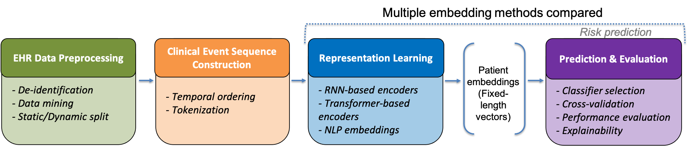

# EHR Temporal Embedding for Infection Risk Prediction in Asplenic Patients 
The software and data in this repository is part of an ongoing activity aiming at developing a computational pipeline for the prediction of risk of severe infections due to compromised immune function for asplenic patients. 
In this study the infection risk prediction capability of a gradient boosting machine relying on ML embedding techniques for representing temporal causal dependences in clinical data from Electronic Health Records is assessed. 

Overview of the proposed framework for infection risk prediction in asplenic patients. The pipeline consists of four main stages: (1) preprocessing of heterogeneous EHR data; (2) construction of temporally ordered clinical event sequences; (3) representation learning, where different embedding models (e.g., NLP-based methods and sequence encoders such as RNN- and Transformer-based architectures) are used to generate fixed-length patient representations; and (4) downstream prediction and evaluation using a selected classifier and explainability software. All embedding methods produce comparable fixed-length patient embeddings, which are subsequently used as input to the same classifier, ensuring a fully decoupled and fair comparison across models. Static patient features can optionally be integrated at the prediction stage.
